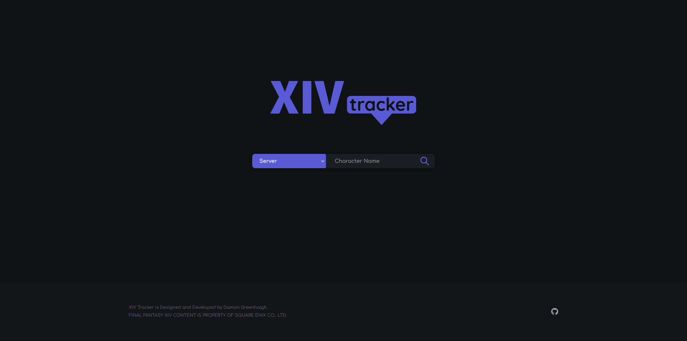
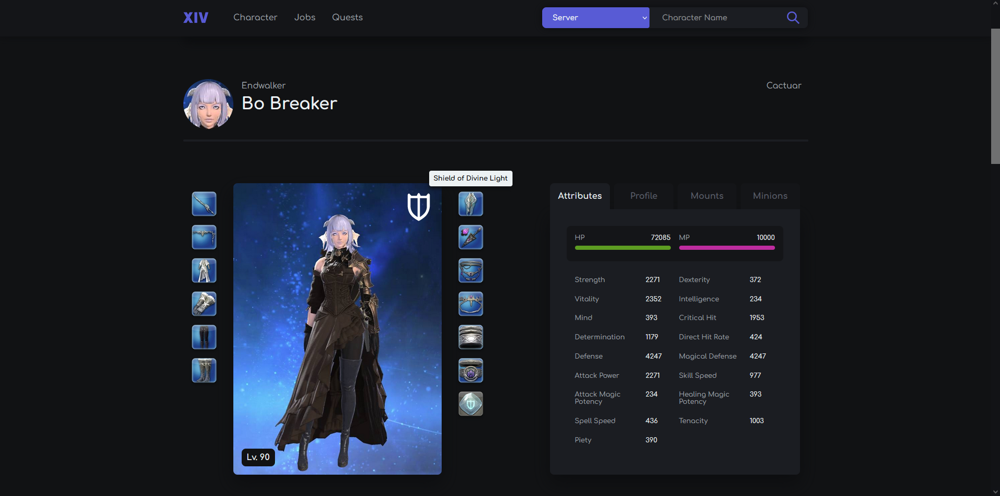
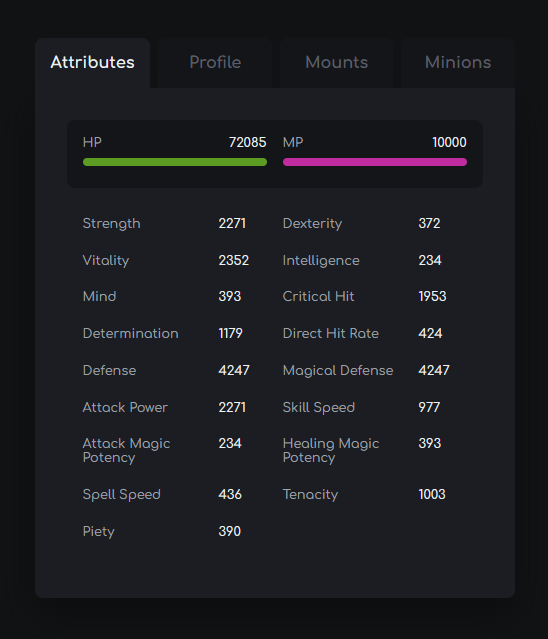
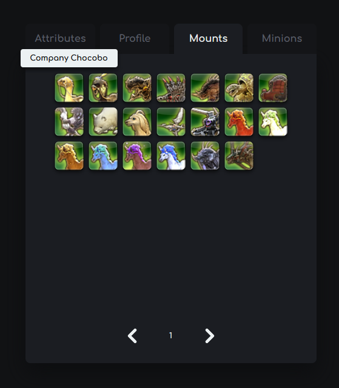
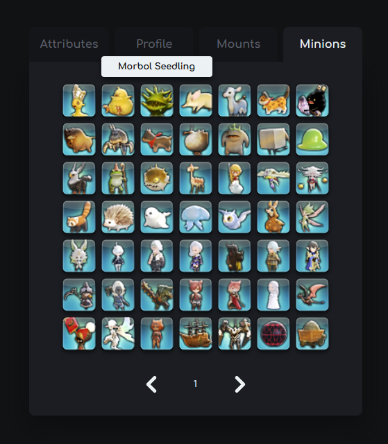
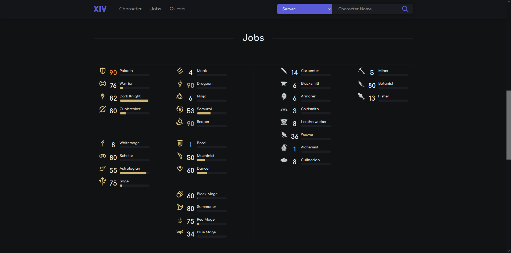
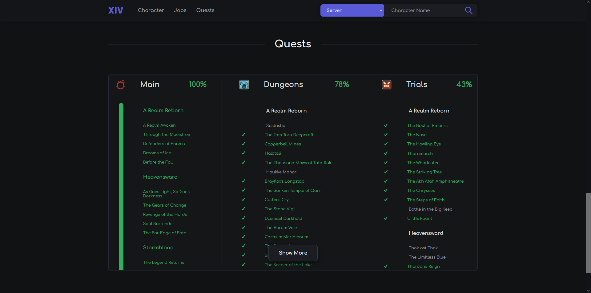
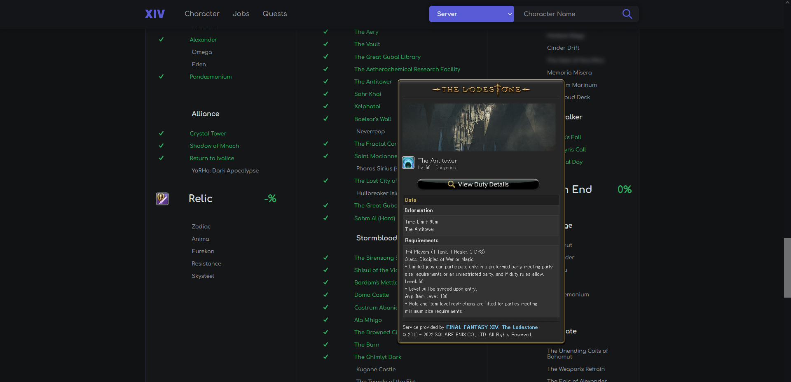

# XIV Tracker
**XIV Tracker** is a tool to help track character progress through Final Fantasy 14.

## Features
Current features of the web app include the following,

- Character display, with currently equiped gear, attributes and profile information.
- Mounts and Minions
- Jobs
- Quest and Duty completions

## Upcoming

- Better non-Eorzea Database tooltips
- Free Company Banner
- Friends
- Updates to raids and other miscellaneous quests.
- General optimization

## Preview

> Home

> Character

> Character Panels, Attributes, Profile, Mounts and Minions.

  
  
  
  
 

> Jobs

> Quests

> Eorzea Database tooltips on quest and duty activities.

