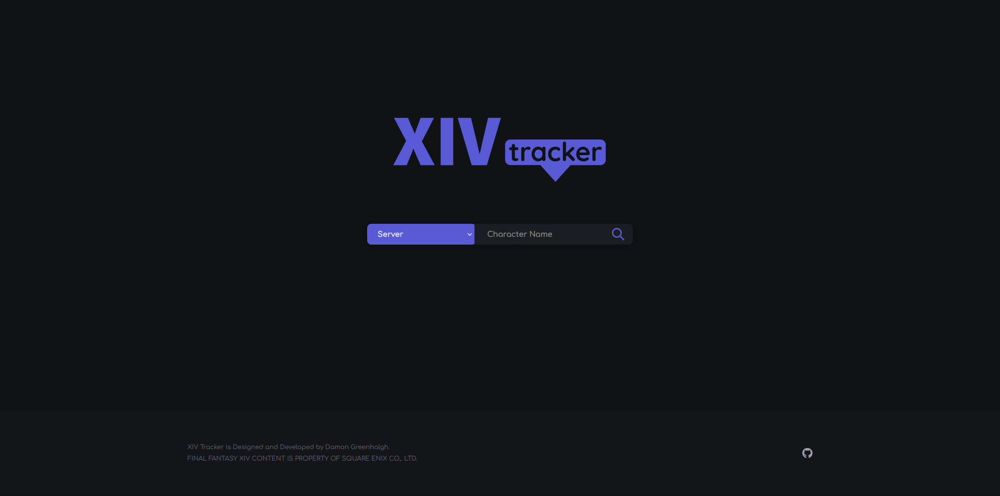
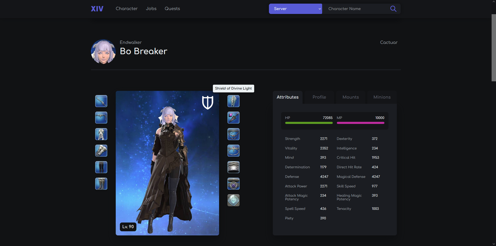
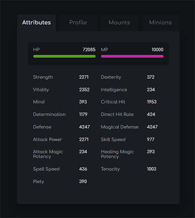
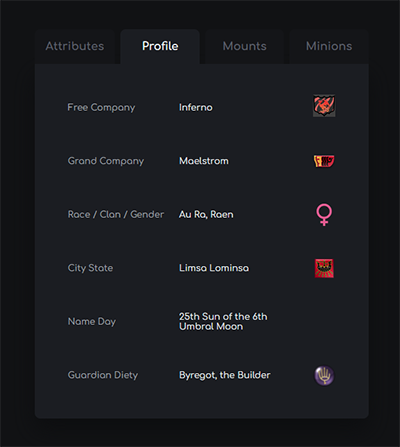
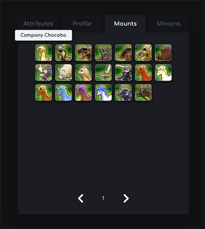
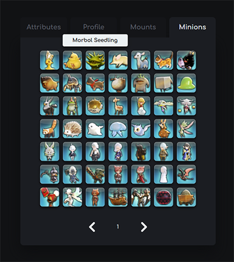
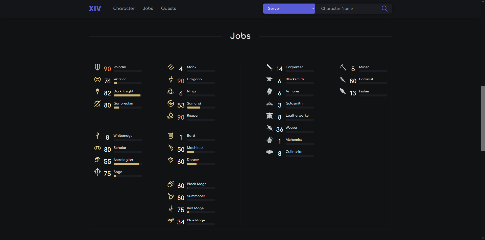
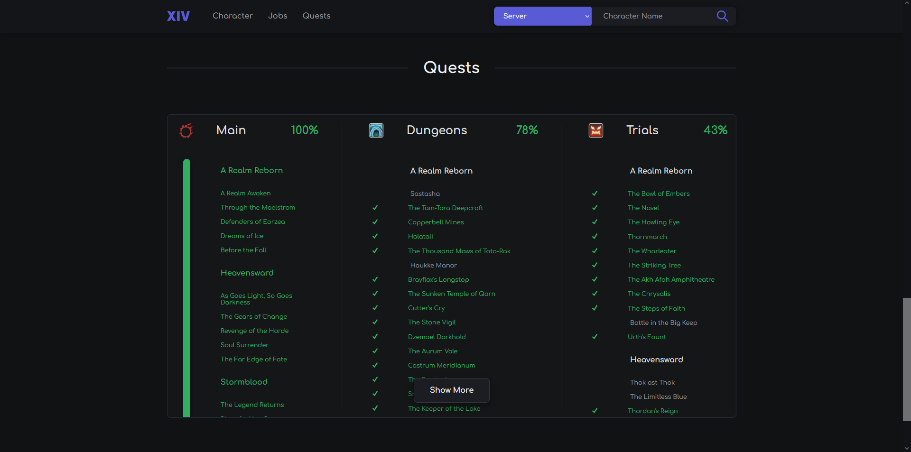
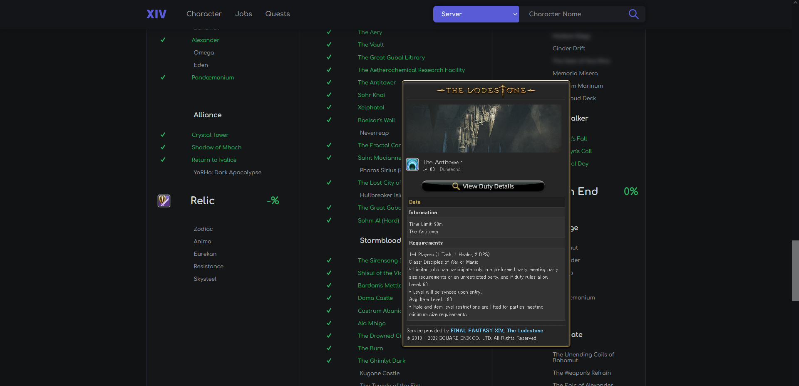

# **THIS REPOSITORY HAS BEEN DEPRECIATED, CONSIDER LOOKING INTO [XIV Tracker](https://github.com/DamonGreenhalgh/xivtracker)**

[*XIV Tracker*](https://damongreenhalgh.github.io/xivtracker) is a website designed to track character data, stats, and much more.

## Features
Current features of the site include the following,

- Character display, with currently equiped gear, attributes and profile information.
- Mounts and Minions
- Jobs
- Quest and Duty completions

## Upcoming

- Better non-Eorzea Database tooltips
- ~Free Company Banner~
- Friends
- Updates to raids and other miscellaneous quests.
- General optimization

## Screenshots

> Home

> Character

> Character Panels, Attributes, Profile, Mounts and Minions.

  
  
  
  
 

> Jobs

> Quests

> Eorzea Database tooltips on quest and duty activities.

